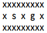

# **GWV – Übungsgruppe Mo. 14 Uhr**

Teilnehmer: **Sven Knodt, André Riedel,** **Johannes Stammer**

Abgabe: So., 10.11.2019

> 1. Implement the blind search strategy "breadth first" to find a path for the robot.
> (3 Pt.)

Siehe Implementierung in *breadth_first.py*

Die Frontier wird durch ein `deque`(Queue) mit `popleft`, und `append`/`extend` (right) als **Warteschlange** implementiert.

> 2. Implement the blind search strategy "depth first" to find a path for the robot. (3 Pt.)

Siehe Implementierung in *depth_first.py*

Die Frontier wird durch ein `deque`(Queue) mit `popleft`, und `appendLeft`/`extendLeft` als **Kellerspeicher** implementiert.

> 3. Provide example mazes that show the differences between and properties of the
>    search strategies. Describe these properties. (2 Pt.)

Im Gegensatz zur Tiefensuche, ist die erste gefundene Lösung der Breitensuche immer (co-)optimal, d.h. der kürzeste Weg wird gefunden.

Eine weitere gravierende Eigenschaft der Breitensuche ist, dass sie exponentiellen Platzbedarf aufweist, während die Tiefensuche nur lineare Platzanforderungen hat (jeweils bezogen auf die Pfadlänge).

Dies hatte bereits bei der Umgebung aus Blatt 3 die Auswirkung, dass Breitensuche ohne *Cycle Checking* und *Path Pruning* zu einer Laufzeit von ~3 min. geführt hat (insbesondere war ein *slow down* aufgrund der Vielzahl an Pfaden auf der Frontier merklich).

> 4. Are there cases in which your program is unable to find a solution? Provide example
>    mazes. (1 Pt.)

Tiefen- und Breitensuche terminieren mit Lösung immer genau dann, wenn eine Lösung existiert. Sind alle Zielpositionen unzugänglich, kann keine Lösung gefunden werden. Bsp.:

> 5. The Figure above shows a modified environment. There are mysterious portals that
>    transport the robot from one field to a pre-determined eld far away. They are
>    denoted with numbers, that is if the robot enters a field with a 1, it is automatically
>    teleported to the other field with a 1 and so on. Modify your program to cope with
>    this change. (3 Pt.)

Siehe (angepasste) Implementierung der *environment.py* (`build_portals` und `use_portals`)

Die ermittelten Nachbarknoten werden durch ein Portal-Dictionary gemappt. Im Dictionary enthaltene (Portal-)Knoten werden auf das/die zugehörigen Portal-Knoten übersetzt, während normale Knoten unverändert bleiben.

